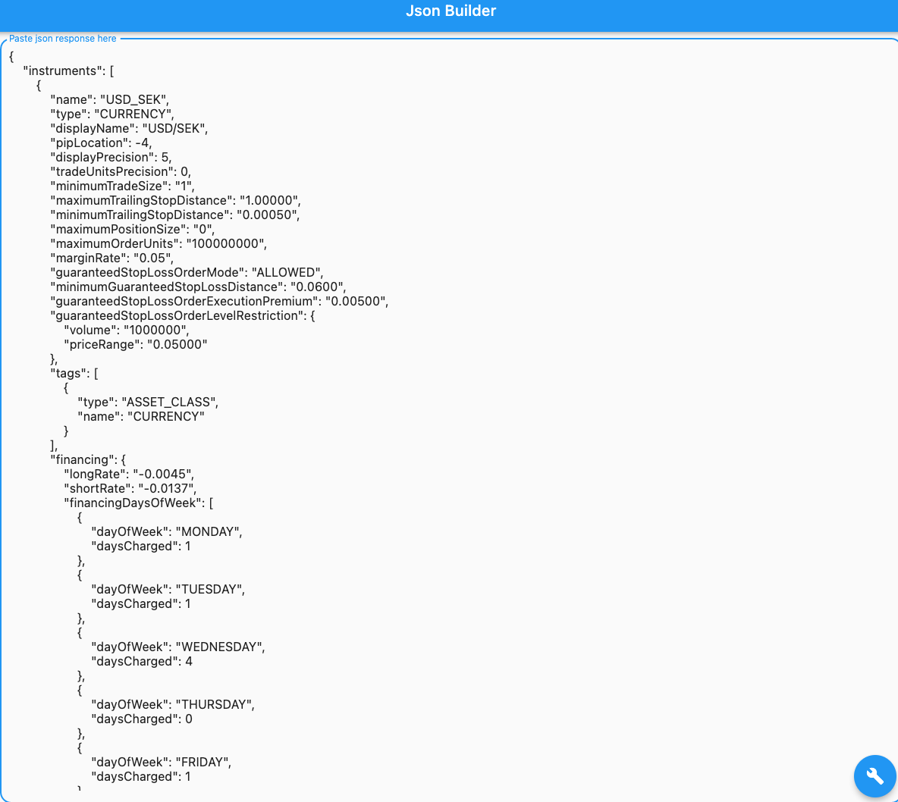
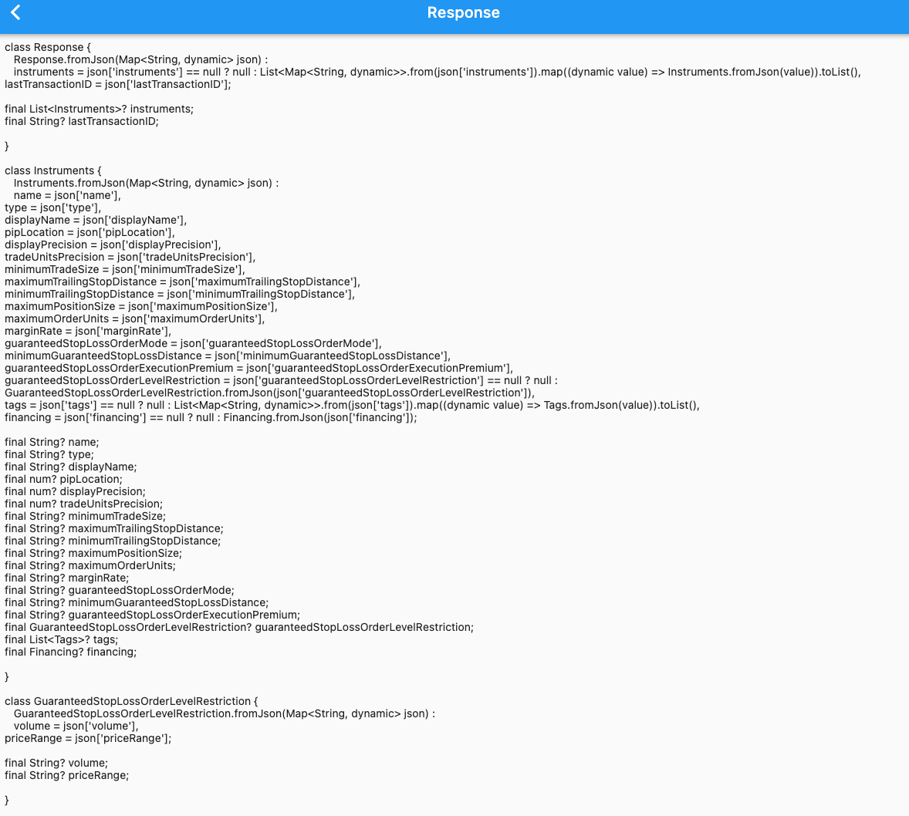

# flutter_json_builder

Flutter Json Builder is a desktop app to help developers to convert json response into dart code without the hassle to create the model and its data type.

## Prerequisite
1. Flutter version is 2.10.2 or higher.
2. Enable Flutter desktop support.

## Getting Started
1. Depending on your platform, run flutter build. For example `flutter build macos`
2. Install the package located in `build` folder. 
3. Paste a json response from an API contract into the text field and click the build icon to convert the model.

---
## Download the final build
If you want to use the app directly without installing, download [final build](./flutter_json_builder.zip) directly and right click to open the app.

---

### Input Sample ###

### Output Sample ###

